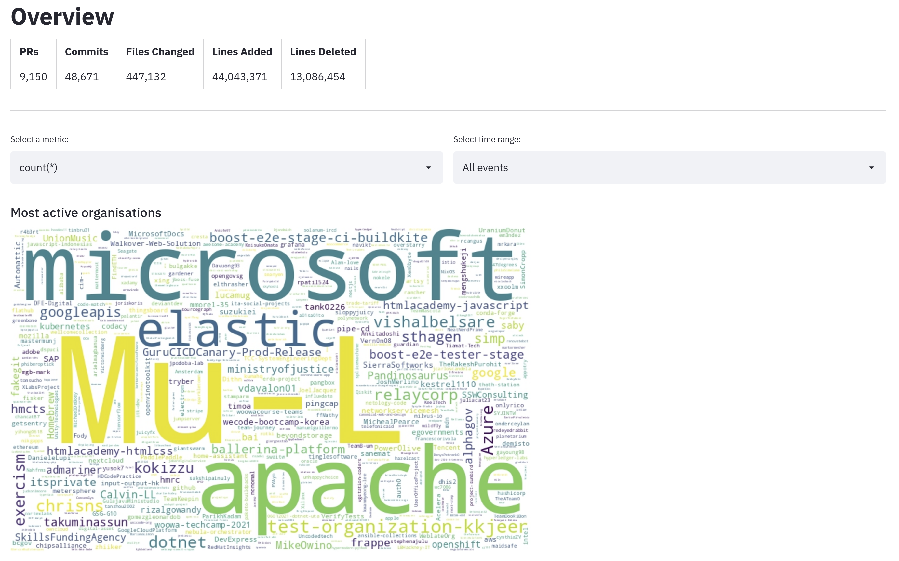

= Analysing GitHub Events with Pinot and Streamlit

This repository contains a Streamlit app running on top of https://docs.pinot.apache.org/basics/recipes/github-events-stream[Apache Pinot's GitHub Events stream Quick Start recipe^].

== Add GitHub token

Go to https://github.com/settings/tokens[personal access tokens^], generate a token, and then paste it into the `.env` file.

== Launch Pinot 

[source, bash]
----
docker-compose up
----

== Streamlit app 

[source, bash]
----
pipenv shell
streamlit run app.py
----
